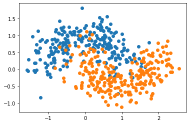

# 随机森林(Random forest)

## 原理

- 是一种集成学习的方法
- 通过在一个数据集上运行多个并行算法, 提升准确率
- sklearn中随机森林底层是决策树
  
- 优点
    - 它可以出来很高维度（特征很多）的数据，并且不用降维，无需做特征选择
    - 它可以判断特征的重要程度
    - 可以判断出不同特征之间的相互影响
    - 不容易过拟合
    - 训练速度比较快，容易做成并行方法
    - 对于不平衡的数据集来说，它可以平衡误差。
    - 如果有很大一部分的特征遗失，仍可以维持准确度。
- 缺点
    - 随机森林已经被证明在某些噪音较大的分类或回归问题上会过拟合。
    - 对于有不同取值的属性的数据，取值划分较多的属性会对随机森林产生更大的影响，所以随机森林在这种数据上产出的属性权值是不可信的  
  


## sklearn实现随机森林


```python
import numpy as np
import matplotlib.pyplot as plt
from sklearn import datasets

X, y = datasets.make_moons(n_samples=500, noise=0.3, random_state=666)
plt.scatter(X[y==0,0], X[y==0,1])
plt.scatter(X[y==1,0], X[y==1,1])
plt.show()
```





```python
from sklearn.ensemble import RandomForestClassifier

rf_clf = RandomForestClassifier(n_estimators=500, oob_score=True, random_state=666, n_jobs=-1)
rf_clf.fit(X, y)
```


    RandomForestClassifier(bootstrap=True, ccp_alpha=0.0, class_weight=None,
                           criterion='gini', max_depth=None, max_features='auto',
                           max_leaf_nodes=None, max_samples=None,
                           min_impurity_decrease=0.0, min_impurity_split=None,
                           min_samples_leaf=1, min_samples_split=2,
                           min_weight_fraction_leaf=0.0, n_estimators=500,
                           n_jobs=-1, oob_score=True, random_state=666, verbose=0,
                           warm_start=False)


```python
rf_clf.oob_score_
```


    0.892


```python
rf_clf2 = RandomForestClassifier(n_estimators=500, max_leaf_nodes=16, oob_score=True, random_state=666, n_jobs=-1)
rf_clf2.fit(X, y)
rf_clf2.oob_score_
```


    0.906


## Extra Trees

- Bagging
- Base Estimator:Decision Tree
- 决策树在节点划分上, 使用随机的特征和随机的阈值
- 更加的随机
- 提供额外的随机性, 抑制过拟合,但增大了bias
- 更快地训练速度


```python
from sklearn.ensemble import ExtraTreesClassifier

et_clf = ExtraTreesClassifier(n_estimators=500, bootstrap=True, oob_score=True, random_state=666, n_jobs=-1)
et_clf.fit(X, y)
```


    ExtraTreesClassifier(bootstrap=True, ccp_alpha=0.0, class_weight=None,
                         criterion='gini', max_depth=None, max_features='auto',
                         max_leaf_nodes=None, max_samples=None,
                         min_impurity_decrease=0.0, min_impurity_split=None,
                         min_samples_leaf=1, min_samples_split=2,
                         min_weight_fraction_leaf=0.0, n_estimators=500, n_jobs=-1,
                         oob_score=True, random_state=666, verbose=0,
                         warm_start=False)


```python
et_clf.oob_score_
```


    0.892


## 集成学习解决回归问题


```python
from sklearn.ensemble import BaggingRegressor
from sklearn.ensemble import RandomForestRegressor
from sklearn.ensemble import ExtraTreesRegressor
```
