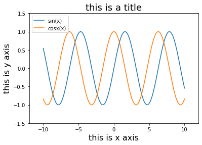
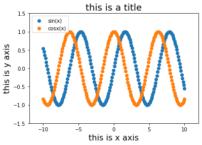

# matplotlib

## 画线图


```python
import matplotlib.pyplot as plt
import numpy as np

sinx = np.linspace(-10,10,200)
cosx = sinx.copy()
siny = np.sin(sinx)
cosy = np.cos(cosx)

plt.plot(sinx,siny,label="sin(x)")
plt.plot(cosx,cosy,label="cosx(x)")
plt.legend() # 加上标记
plt.xlim(-12,12)
plt.ylim(-1.5,1.5)
plt.xlabel("this is x axis",fontdict = {'fontsize': 16})
plt.ylabel("this is y axis",fontdict = {'fontsize': 16})
plt.title("this is a title", fontdict = {'fontsize': 18})

```


    Text(0.5, 1.0, 'this is a title')





## 画散点图


```python
# 画散点图

plt.scatter(sinx,siny,label="sin(x)")
plt.scatter(cosx,cosy,label="cosx(x)")
plt.legend()
plt.xlim(-12,12)
plt.ylim(-1.5,1.5)
plt.xlabel("this is x axis",fontdict = {'fontsize': 16})
plt.ylabel("this is y axis",fontdict = {'fontsize': 16})
plt.title("this is a title", fontdict = {'fontsize': 18})
```


    Text(0.5, 1.0, 'this is a title')





```python

```
