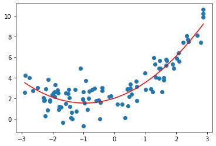

# 多项式回归(Polynomial Regression)

## 原理

  
  
- 简单线性回归无法拟合复杂模型
- 通过增加参数(degree)的方法进行提升
- degree = 3
$$
\begin{aligned}
&1, x_{1}, x_{2}\\
&x_{1}^{2}, x_{2}^{2}, x_{1} x_{2}\\
&x_{1}^{3}, x_{2}^{3}, x_{1}^{2} x_{2}, x_{1} x_{2}^{2}
\end{aligned}
$$

## 底层实现


```python
import numpy as np 
import matplotlib.pyplot as plt
#生成数据
x = np.random.uniform(-3, 3, size=100)
X = x.reshape(-1, 1)
y = 0.5 * x**2 + x + 2 + np.random.normal(0, 1, 100)
#画图
plt.scatter(x, y)
plt.show()

```


```python
#线性回归
from sklearn.linear_model import LinearRegression
#建立线性回归模型
lin_reg = LinearRegression()
lin_reg.fit(X, y)
y_predict = lin_reg.predict(X)
#画图
print("建立线性回归模型")
plt.scatter(x, y)
plt.plot(x, y_predict, color='r')
plt.show()

#添加一个参数
X2 = np.hstack([X, X**2])
X2.shape
#建立多项式回归模型
lin_reg2 = LinearRegression()
lin_reg2.fit(X2, y)
y_predict2 = lin_reg2.predict(X2)
# 画图
print("建立多项式回归模型")
plt.scatter(x, y)
plt.plot(np.sort(x), y_predict2[np.argsort(x)], color='r')
plt.show()
```

    建立线性回归模型


    建立多项式回归模型


```python
print(lin_reg2.coef_)
print(lin_reg2.intercept_)
```

    [1.09973337 0.52419583]
    1.8518814838901312


## sklearn实现

- 将数据PolynomialFeatures
- 生成新的数据
- 传给LinearRegression()
- degree()决定了最好几次幂  


### PolynomialFeatures


```python
import numpy as np 
import matplotlib.pyplot as plt
#生成数据
x = np.random.uniform(-3, 3, size=100)
X = x.reshape(-1, 1)
y = 0.5 * x**2 + x + 2 + np.random.normal(0, 1, 100)
```


```python
from sklearn.preprocessing import PolynomialFeatures

# 1.确定PolynomialFeatures最高幂
poly = PolynomialFeatures(degree=2)
# 2.fit训练数据
poly.fit(X)
# 3.生成新的数据
X2 = poly.transform(X)
print("新的数据的shape"+str(X2.shape))
```

    新的数据的shape(100, 3)


```python
from sklearn.linear_model import LinearRegression
# 可视化
lin_reg2 = LinearRegression()
lin_reg2.fit(X2, y)
y_predict2 = lin_reg2.predict(X2)
plt.scatter(x, y)
plt.plot(np.sort(x), y_predict2[np.argsort(x)], color='r')
plt.show()
```





### Pipeline


```python
from sklearn.pipeline import Pipeline
from sklearn.preprocessing import StandardScaler
from sklearn.linear_model import LinearRegression

# 生成数据
x = np.random.uniform(-3, 3, size=100)
X = x.reshape(-1, 1)
y = 0.5 * x**2 + x + 2 + np.random.normal(0, 1, 100)

# Pipeline的步骤
poly_reg = Pipeline([
    ("poly", PolynomialFeatures(degree=2)),
    ("std_scaler", StandardScaler()),
    ("lin_reg", LinearRegression())
])

poly_reg.fit(X, y)
y_predict = poly_reg.predict(X)

plt.scatter(x, y)
plt.plot(np.sort(x), y_predict[np.argsort(x)], color='r')
plt.show()
```


