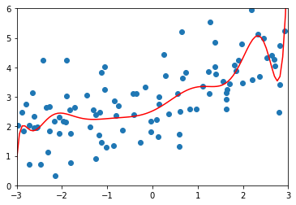
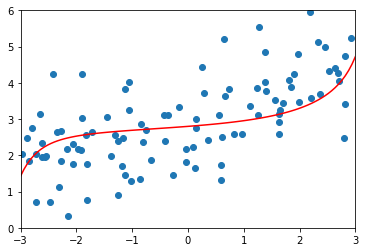
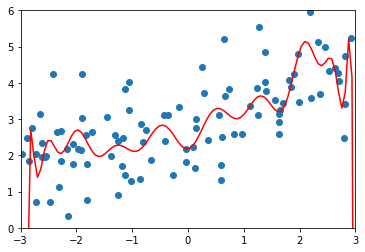
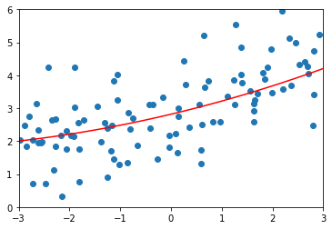
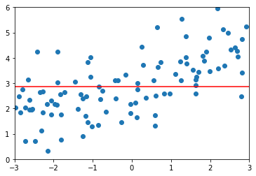

# 正则化(Regularization)

- 模型的误差 = 偏差 + 方差 + 误差(噪声)

- 解决方差的手段
  1. 降低模型复杂度
  2. 降维；降噪
  3. 增加样本数
  4. 使用验证数据集  
  5. **模型的正则化**  

## L2-岭回归(Ridge)

### 原理

- 是目标函数尽可能小
$$J\left( \theta  \right){\rm{ = }}MSE(y,\hat y;\theta ) + \alpha \frac{1}{2}\sum\limits_{i = 1}^n {\theta _i^2}$$
- 后面的这项就是岭回归
$$\alpha \frac{1}{2}\sum\limits_{i = 1}^n {\theta _i^2}$$
- 岭回归通过最小化$\theta$的和，从而防止过拟合
- 与LASSO回归不同，趋向与让$\theta$为为一更更小的值

### 代码实现


```python
import numpy as np
import matplotlib.pyplot as plt

np.random.seed(42)
x = np.random.uniform(-3.0, 3.0, size=100)
X = x.reshape(-1, 1)
y = 0.5 * x + 3 + np.random.normal(0, 1, size=100)

# 训练一个过拟合的模型
from sklearn.pipeline import Pipeline
from sklearn.preprocessing import PolynomialFeatures
from sklearn.preprocessing import StandardScaler
from sklearn.linear_model import LinearRegression
from sklearn.model_selection import train_test_split


def PolynomialRegression(degree):
    return Pipeline([("poly", PolynomialFeatures(degree=degree)),
                     ("std_scaler", StandardScaler()),
                     ("lin_reg", LinearRegression())])


np.random.seed(666)
X_train, X_test, y_train, y_test = train_test_split(X, y)

poly_reg = PolynomialRegression(degree=20)
poly_reg.fit(X_train, y_train)

y_poly_predict = poly_reg.predict(X_test)


def plot_model(model):
    X_plot = np.linspace(-3, 3, 100).reshape(100, 1)
    y_plot = model.predict(X_plot)

    plt.scatter(x, y)
    plt.plot(X_plot[:, 0], y_plot, color='r')
    plt.axis([-3, 3, 0, 6])
    plt.show()


plot_model(poly_reg)
```


```python
# 使用岭回归

from sklearn.linear_model import Ridge
from sklearn.metrics import mean_squared_error

#pipline初始化模型
def RidgeRegression(degree, alpha):
    return Pipeline([
        ("poly", PolynomialFeatures(degree=degree)),
        ("std_scaler", StandardScaler()),
        ("ridge_reg", Ridge(alpha=alpha))
    ])
# L1正则的α值为 0.0001
ridge1_reg = RidgeRegression(20, 0.0001)
ridge1_reg.fit(X_train, y_train)
y1_predict = ridge1_reg.predict(X_test)
plot_model(ridge1_reg)
print("L2正则的α值为 0.0001")
# L1正则的α值为 1000
ridge3_reg = RidgeRegression(20, 100)
ridge3_reg.fit(X_train, y_train)
y3_predict = ridge3_reg.predict(X_test)
mean_squared_error(y_test, y3_predict)
plot_model(ridge3_reg)
print("L2正则的α值为 100")
# L1正则的α值为 10000000，这时theta全为0
ridge4_reg = RidgeRegression(20, 10000000)
ridge4_reg.fit(X_train, y_train)
y4_predict = ridge4_reg.predict(X_test)
mean_squared_error(y_test, y4_predict)
plot_model(ridge4_reg)
print("L2正则的α值为10000000,theta全为0")
```





    L2正则的α值为 0.0001





    L2正则的α值为 100


    L2正则的α值为10000000,theta全为0


## L1-LASSO-Regression

### 原理

- 是目标函数尽可能小
$$J\left( \theta  \right){\rm{ = }}MSE(y,\hat y;\theta ) + \alpha \frac{1}{2}\sum\limits_{i = 1}^n | {{\theta _i}}|$$
- 后面的这项LASSO Regression
$$\left| {{\theta _i}} \right|$$
- LASSO Regression通过最小化$\theta$的和，从而防止过拟合
- 与岭回归不同，趋向与让$\theta$为0


### 代码实现


```python
import numpy as np
import matplotlib.pyplot as plt
from sklearn.model_selection import train_test_split
from sklearn.pipeline import Pipeline
from sklearn.preprocessing import PolynomialFeatures
from sklearn.preprocessing import StandardScaler
from sklearn.linear_model import LinearRegression
#生成过拟合模型
np.random.seed(42)
x = np.random.uniform(-3.0, 3.0, size=100)
X = x.reshape(-1, 1)
y = 0.5 * x + 3 + np.random.normal(0, 1, size=100)
np.random.seed(666)
X_train, X_test, y_train, y_test = train_test_split(X, y)


def PolynomialRegression(degree):
    return Pipeline([("poly", PolynomialFeatures(degree=degree)),
                     ("std_scaler", StandardScaler()),
                     ("lin_reg", LinearRegression())])


poly_reg = PolynomialRegression(degree=20)
poly_reg.fit(X_train, y_train)

y_predict = poly_reg.predict(X_test)


def plot_model(model):
    X_plot = np.linspace(-3, 3, 100).reshape(100, 1)
    y_plot = model.predict(X_plot)

    plt.scatter(x, y)
    plt.plot(X_plot[:, 0], y_plot, color='r')
    plt.axis([-3, 3, 0, 6])
    plt.show()


plot_model(poly_reg)
```





```python
from sklearn.linear_model import Lasso

def LassoRegression(degree, alpha):
    return Pipeline([
        ("poly", PolynomialFeatures(degree=degree)),
        ("std_scaler", StandardScaler()),
        ("lasso_reg", Lasso(alpha=alpha))
    ])

lasso1_reg = LassoRegression(20, 0.01)
lasso1_reg.fit(X_train, y_train)
y1_predict = lasso1_reg.predict(X_test)
plot_model(lasso1_reg)

lasso2_reg = LassoRegression(20, 0.1)
lasso2_reg.fit(X_train, y_train)
y2_predict = lasso2_reg.predict(X_test)
plot_model(lasso2_reg)

lasso3_reg = LassoRegression(20, 1)
lasso3_reg.fit(X_train, y_train)
y3_predict = lasso3_reg.predict(X_test)
plot_model(lasso3_reg)
```







